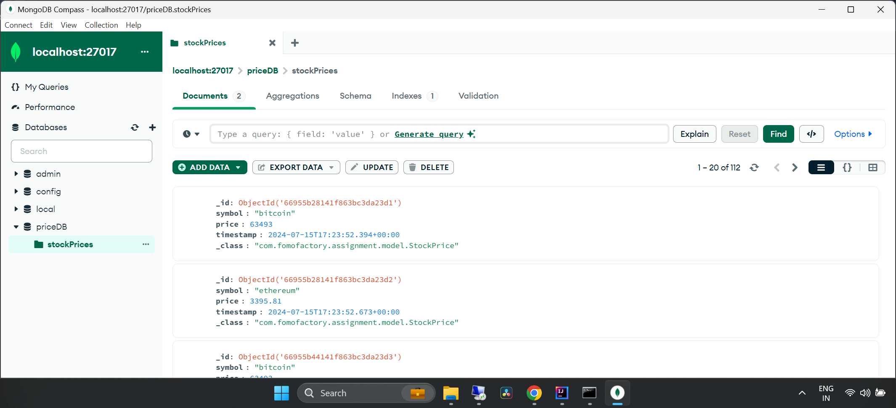
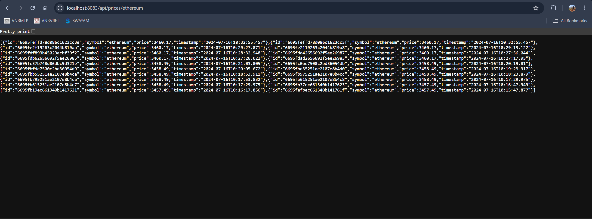
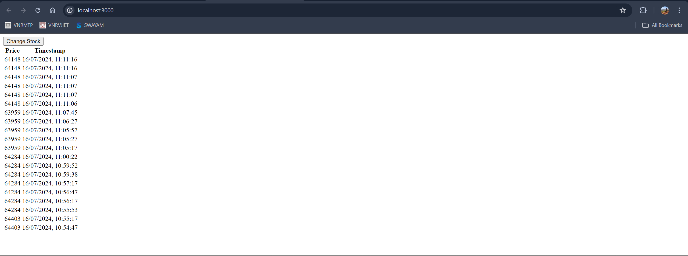

# Fomo-Factory-Assignment-
Fomo Factory Assignment 
# Mini-Website for Real-Time Stock Price Data
Assignment submitted by Bojja Srikar

## Backend

1. Clone the repository.
2. Navigate to the backend directory and run `mvn clean install`.
3. Set up MongoDB and update `application.properties` with the connection details.
4. Run the Spring Boot application.

## Frontend

1. Navigate to the frontend directory My-app.
2. Run `npm install` to install dependencies.
3. Run `npm run dev` to start the Next.js application.
4. Open `http://localhost:3000` in your browser.

## Notes

- Adjust polling intervals and API endpoints as necessary.
- Ensure MongoDB is running before starting the backend.
## MONGODB DATA

## BACKEND URL

## FRONT END UI

